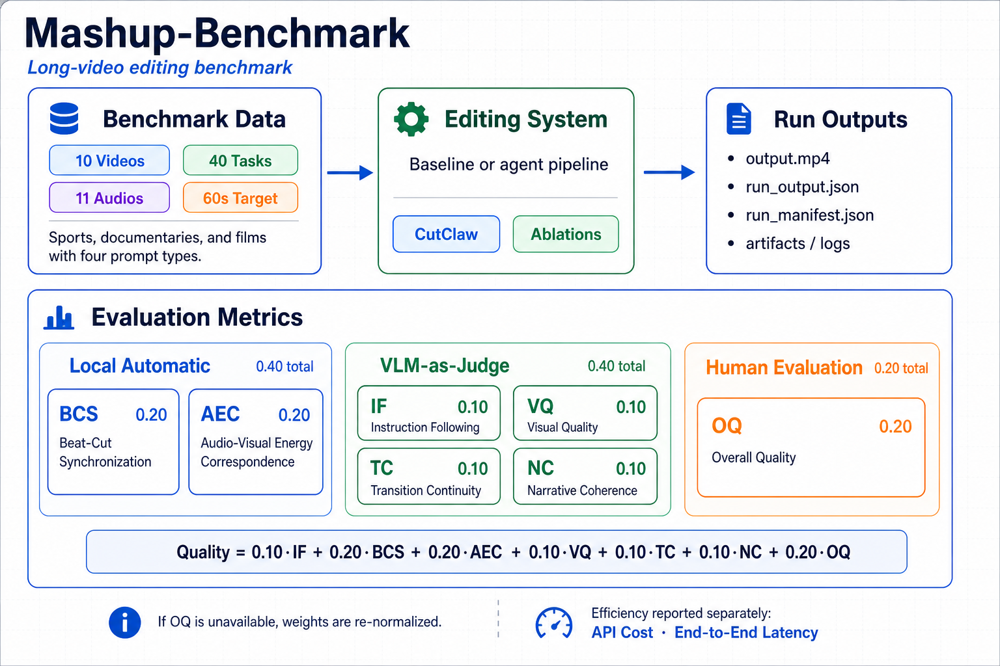

# Mashup-Benchmark

[English](README_EN.md)

Mashup-Benchmark 是一个面向长视频自动剪辑的 benchmark，用于评估短视频混剪、精彩集锦和音乐驱动剪辑系统的生成质量与效率。



## 数据集

- 10 个小时级长视频源：3 场体育赛事、3 集纪录片、4 部电影。
- 40 个视频-提示词任务：每个长视频对应 4 类任务，分别是事件型、人物型、情绪型和叙事型。
- 11 首 Mixkit BGM，根据任务情绪和风格进行分配。
- 默认目标成片时长：60 秒。
- 默认目标 shot 时长：4 秒。

标准任务文件是 `data/tasks/mashup_benchmark.jsonl`，其中每一行对应一个视频-提示词-音频任务。媒体文件按 `data/videos/<video_id>/...` 和 `data/audios/<audio_id>/...` 组织。任务 id 命名为 `task_<index>`，范围为 `task_001` 到 `task_040`。

### 视频

| 编号          | 类型     | 名称                                                                             |     时长 | 分辨率    |
| ------------- | -------- | -------------------------------------------------------------------------------- | -------: | --------- |
| `video_001` | 体育赛事 | 美加墨世界杯A组第1轮：墨西哥VS南非FIFA World Cup Group A: Mexico vs South Africa | 01:38:53 | 480x270   |
| `video_002` | 体育赛事 | 美加墨世界杯H组第1轮：西班牙VS佛得角FIFA World Cup Group H: Spain vs Cape Verde  | 02:03:58 | 1920x1080 |
| `video_003` | 体育赛事 | 美加墨世界杯E组第1轮：德国VS库拉索FIFA World Cup Group E: Germany vs Curacao     | 02:09:00 | 1920x1080 |
| `video_004` | 纪录片   | 地球脉动 第一季第一集：From Pole to PolePlanet Earth S01E01: From Pole to Pole   |    49:02 | 1920x1080 |
| `video_005` | 纪录片   | 地球脉动 第一季第二集：MountainsPlanet Earth S01E02: Mountains                   |    47:52 | 1920x1080 |
| `video_006` | 纪录片   | 地球脉动 第一季第三集：Fresh WaterPlanet Earth S01E03: Fresh Water               |    49:11 | 1920x1080 |
| `video_007` | 电影     | 教父1The Godfather (1972)                                                        | 02:57:09 | 1920x1080 |
| `video_008` | 电影     | 千与千寻Spirited Away (2001)                                                     | 02:04:32 | 1920x1038 |
| `video_009` | 电影     | 爱乐之城La La Land (2016)                                                        | 02:07:48 | 1920x754  |
| `video_010` | 电影     | 星际穿越Interstellar (2014)                                                      | 02:49:04 | 1920x1080 |

### 音频

| 编号          | 曲名                 | 作者                     |  时长 | 风格标签                                      |
| ------------- | -------------------- | ------------------------ | ----: | --------------------------------------------- |
| `audio_001` | Sports Highlights    | Ahjay Stelino            | 01:36 | sports, rock, aggressive, propulsive          |
| `audio_002` | Dirty Thinkin'       | Michael Ramir C.         | 01:29 | funk, energetic, groove, playful              |
| `audio_003` | Techno Fest Vibes    | Alejandro Magana (A. M.) | 01:09 | edm, high_energy, driving, celebratory        |
| `audio_004` | Fright Night         | Michael Ramir C.         | 01:41 | cinematic, tension, dark, suspense            |
| `audio_005` | Sun and His Daughter | Eugenio Mininni          | 02:48 | nature, poetic, world, expansive              |
| `audio_006` | Discover             | Eugenio Mininni          | 02:24 | documentary, hopeful, orchestral, wonder      |
| `audio_007` | Relax Beat           | Arulo                    | 01:48 | ambient, calm, observational, soft            |
| `audio_008` | Silent Descent       | Eugenio Mininni          | 02:40 | film_score, melancholic, reflective, dramatic |
| `audio_009` | Epical Drums 01      | Grigoriy Nuzhny          | 01:46 | cinematic, drums, epic, action                |
| `audio_010` | Romantic Getaway     | Ahjay Stelino            | 01:44 | romantic, warm, emotional, classical          |
| `audio_011` | Romantic Vacation    | Ahjay Stelino            | 01:52 | jazz, romantic, lounge, stylish               |

## 目录结构

```text
Mashup-Benchmark/
  data/
    tasks/mashup_benchmark.jsonl # 标准 40 任务 JSONL
    videos/<video_id>/             # 长视频源文件目录，Git 忽略
    audios/<audio_id>/             # BGM 音频文件目录，Git 忽略
  manifests/                     # 视频、音频、任务和统计摘要索引
  schemas/                       # task/run/evaluation 记录的 JSON Schema
  scripts/                       # 校验脚本和工具脚本
  runs/                          # 待测系统输出、run_output.json 和 run_manifest.json
  outputs/                       # 非正式提交 run 的临时导出结果
  eval/                          # 评测代码
  eval_results/                  # 指标结果和 VLM-as-judge 打分结果
  reports/                       # 汇总表格、图表和实验记录
  docs/                          # benchmark 规范、指标协议和数据说明
```

## 系统输出格式

一个 `run` 表示某个 baseline 或消融配置在一个或多个 benchmark task 上的完整输出。每个任务需要生成一个完整的短视频成片，并按下面的结构保存：

```text
runs/<run_id>/
  run_manifest.json             # 整次运行的全局元数据，符合 schemas/run_manifest.schema.json
  run_outputs.jsonl             # 每个 task 的 run_output.json 记录汇总，每行一个 JSON
  task_outputs/
    <task_id>/
      output.mp4                # 该 task 的最终成片，评测器直接读取这个视频
      run_output.json           # 该 task 的元数据，符合 schemas/run_output.schema.json
      logs/
        backend.log             # 可选，原始 pipeline 日志
        render.log              # 可选，渲染日志
      artifacts/
        benchmark_task.json     # 可选，该 task 的输入定义快照
        shot_plan.json          # 可选，方法内部生成的剪辑计划
        shot_point.json         # 可选，方法内部生成的剪辑点或时间线
```

其中 `<run_id>` 用于标识方法和实验设置，例如 `cutclaw_benchmark` 或 `cutmaster_embedding_v4_full`；`<task_id>` 使用 `task_001` 到 `task_040` 的规范编号。评测时最小必需文件是 `run_manifest.json`、`run_outputs.jsonl`，以及每个成功 task 下的 `output.mp4` 和 `run_output.json`。详细提交格式见 `docs/run_submission_format.md`。

## 环境配置

本 benchmark 使用 `uv` 管理自己的 Python 环境，避免依赖任何 baseline 项目的虚拟环境。首次使用时在 benchmark 根目录运行：

```bash
uv sync
```

之后推荐通过 `uv run` 执行校验、adapter 和评测脚本：

```bash
uv run python scripts/validate_benchmark.py
uv run python scripts/validate_run.py runs/<run_id>
uv run python -m eval.run_evaluation --run runs/<run_id> --config eval/config.yaml
```

媒体解码和自动指标计算依赖系统命令 `ffmpeg` 与 `ffprobe`，它们不由 Python 环境安装；请确保二者在 `PATH` 中可用。VLM 密钥等本地配置写入 `eval/config.yaml`，该文件已被 Git 忽略。

## 评测维度

完整质量分包含 7 个指标：

```text
Quality = weighted_mean(IF, BCS, AEC, VQ, TC, NC, OQ)
```

权重规则：

- 本地自动指标：`BCS = 0.20`，`AEC = 0.20`。
- VLM-as-judge 指标：`IF = 0.10`，`VQ = 0.10`，`TC = 0.10`，`NC = 0.10`。
- 人类评估指标：`OQ = 0.20`。
- 如果没有人类 `OQ` 分数，则对可用的 6 个指标自动归一化：`BCS = 0.25`，`AEC = 0.25`，`IF/VQ/TC/NC = 0.125`。

指标含义：

- IF：Instruction Following，指令遵循。
- BCS：Beat-Cut Synchronization，节拍-切点同步；基于最终成片的全帧视觉切换检测，不读取编辑 timeline。
- AEC：Audio-Visual Energy Correspondence，音画能量对应。
- VQ：Visual Quality，视觉质量。
- TC：Transition Continuity，片段和转场连续性。
- NC：Narrative Coherence，叙事连贯性。
- OQ：Overall Quality，人类整体质量评分，可选。

效率单独报告，包括 API 成本和端到端耗时。可运行评测器的说明见 `eval/README.md`。

## Baseline 评测

本 benchmark 计划对比以下三个长视频 mashup/editing baseline。所有 baseline 的标准化输出均写入 `runs/<run_id>/`，并遵循 `schemas/run_manifest.schema.json` 与 `schemas/run_output.schema.json`。

### Baseline Adapter 通用配置

每个 baseline adapter 都应尽量遵循同一组通用参数，方便批量实验、复现和接入统一评测器。不同方法的项目根目录、Python 环境和原始输出可以各自独立，但最终都需要写出 benchmark 标准化的 `runs/<run_id>/` 结构。

| 参数模式                | 说明                                                                                                                                                                     |
| ----------------------- | ------------------------------------------------------------------------------------------------------------------------------------------------------------------------ |
| `--<baseline>-root`   | 外部 baseline 项目根目录，例如`--cutclaw-root`。adapter 会在该目录中调用 baseline 原始入口脚本。                                                                       |
| `--<baseline>-python` | 外部 baseline 使用的 Python 解释器，例如`--cutclaw-python`。默认建议优先使用 `<baseline-root>/.venv/bin/python`，也可以显式指定 conda、uv 或其他虚拟环境中的解释器。 |
| `--task-id`           | 指定一个或多个 benchmark task，例如`task_006`。task 定义来自 `data/tasks/mashup_benchmark.jsonl`。                                                                   |
| `--all`               | 批量运行全部 40 个 benchmark task。                                                                                                                                      |
| `--run-id`            | 标准化结果目录名，输出到`runs/<run_id>/`。建议用方法名和实验设置命名，例如 `cutclaw_benchmark`。                                                                     |
| `--results-root`      | 标准化结果根目录，默认是 benchmark 仓库内的`runs/`。该目录应保持在 benchmark 根目录下，便于 schema 校验和评测器读取。                                                  |
| `--method`            | 写入 manifest 的方法名，例如`cutclaw`、`direct_claw`、`videoagent`。                                                                                               |
| `--method-version`    | 写入 manifest 的方法版本或实验标识，用于区分原版、消融实验和不同模型配置。                                                                                               |
| `--overwrite`         | 即使该 task 的`output.mp4` 已存在，也重新生成。默认行为是同名 run 可继续补跑：已成功且有成片的 task 会跳过，失败或不完整 task 会重试。                                  |
| `--dry-run`           | 只打印将要执行的命令并写入跳过元数据，不调用模型或渲染，适合检查路径和参数。                                                                                             |

方法独有的开关放在各 baseline 小节中说明，例如 CutClaw 的 hook dialogue、ending video、裁剪比例和原视频音量。

### CutClaw

CutClaw: Agentic Hours-Long Video Editing via Music Synchronization

- 项目：[https://github.com/GVCLab/CutClaw](https://github.com/GVCLab/CutClaw)
- Fork：[https://github.com/hit-cxf/CutClaw](https://github.com/hit-cxf/CutClaw)
- 论文：[https://arxiv.org/abs/2603.29664](https://arxiv.org/abs/2603.29664)
- 当前状态：已提供 benchmark adapter。

使用 benchmark 侧的 CutClaw adapter 运行指定任务，并将可评测产物写入 `runs/<run_id>/`：

```bash
python3 scripts/run_cutclaw.py \
  --cutclaw-root /Users/xinfanchen/Project/CutClaw \
  --task-id task_006 \
  --run-id cutclaw_benchmark
```

批量运行全部任务：

```bash
python3 scripts/run_cutclaw.py \
  --cutclaw-root /Users/xinfanchen/Project/CutClaw \
  --all \
  --run-id cutclaw_benchmark
```

CutClaw 特有参数：

| 参数                        | 说明                                                                           |
| --------------------------- | ------------------------------------------------------------------------------ |
| `--no-hook-dialogue`      | 渲染时不添加 CutClaw 的 hook dialogue 开场。                                   |
| `--no-ending`             | 渲染时不追加 CutClaw 的 ending video。                                         |
| `--crop-ratio`            | 可选裁剪比例，例如`16:9`、`9:16`、`1:1`。                                |
| `--original-audio-volume` | 原视频声音混入音量，默认`0.0`，即只保留 BGM。                                |
| `--video-type`            | 传给 CutClaw 的视频类型参数，当前默认使用`film`，用于兼容 CutClaw 原始入口。 |

同一个 `run_id` 可以重复运行来补齐失败任务。默认情况下，adapter 会复用已有的成功任务输出；如果某个 task 之前记录为 `failed`，或者没有生成 `output.mp4`，再次运行同名 `run_id` 时会重试该 task。需要强制重跑所有已成功任务时再使用 `--overwrite`。

CutClaw 的原始中间结果仍保存在 CutClaw 项目的 `Output/` 中；benchmark 只保存用于评测的标准化 `runs/<run_id>/` 结构。运行完成后可用以下命令校验并评测：

```bash
python3 scripts/validate_run.py runs/cutclaw_benchmark
python3 -m eval.run_evaluation --run runs/cutclaw_benchmark --config eval/config.yaml
```

### DIRECT-Claw

DIRECT: Video Mashup Creation via Hierarchical Multi-Agent Planning and Intent-Guided Editing

- 项目：[https://github.com/AK-DREAM/DIRECT-Claw](https://github.com/AK-DREAM/DIRECT-Claw)
- Fork：[https://github.com/hit-cxf/DIRECT-Claw](https://github.com/hit-cxf/DIRECT-Claw)
- 论文：[https://arxiv.org/abs/2604.04875](https://arxiv.org/abs/2604.04875)
- 当前状态：待接入 benchmark adapter。

### VideoAgent

VideoAgent: All-in-One Framework for Video Understanding and Editing

- 项目：[https://github.com/HKUDS/VideoAgent](https://github.com/HKUDS/VideoAgent)
- Fork：[https://github.com/hit-cxf/VideoAgent](https://github.com/hit-cxf/VideoAgent)
- 论文：[https://arxiv.org/abs/2606.23327](https://arxiv.org/abs/2606.23327)
- 当前状态：已提供 benchmark adapter。

VideoAgent 原始入口是 `python main.py` 的交互式 TUI：系统先用 LLM 做 intent analysis、agent graph planning、graph judge/reflection，再向用户询问缺失参数。为保证 benchmark 可批量、可复现、可校验，当前 adapter 固定使用 VideoAgent 中与音乐混剪最直接相关的子流程：

```text
VideoPreloader -> RhythmDetector -> RhythmContentGenerator -> VideoSearcher -> VideoEditor
```

服务器复现实验环境：

| 项目 | 配置 |
| ---- | ---- |
| 机器 | AutoDL Ubuntu 22.04 |
| GPU | NVIDIA GeForce RTX 4090 24GB |
| VideoAgent 环境 | `/root/miniconda3/envs/videoagent/bin/python` |
| Benchmark 环境 | benchmark 根目录下使用 `uv run` |
| VideoAgent 根目录 | `/root/autodl-tmp/VideoAgent` |
| Benchmark 根目录 | `/root/autodl-tmp/Mashup-Benchmark` |

运行单个任务：

```bash
cd /root/autodl-tmp/Mashup-Benchmark
uv run python3 scripts/run_videoagent.py \
  --task-id task_001 \
  --run-id videoagent_benchmark_smoke \
  --overwrite
```

批量运行全部任务：

```bash
cd /root/autodl-tmp/Mashup-Benchmark
uv run python3 scripts/run_videoagent.py \
  --all \
  --run-id videoagent_benchmark \
  --overwrite
```

VideoAgent adapter 复现改动与理由：

| 改动 | 理由 |
| ---- | ---- |
| 绕过交互式 TUI，直接调用固定工具链 | benchmark 需要无人值守批量运行；动态 graph planning 会引入额外随机性和交互输入。 |
| 使用 `videoagent` conda 环境的 Python 解释器执行 worker | 保持 VideoAgent 原依赖环境，避免 benchmark 的 `uv` 环境污染 baseline。 |
| 为源视频创建无下划线别名，例如 `video001.mp4` | VideoAgent 的 `VideoEditor` 用 `segment_id.split("_")` 解析片段名，原始 benchmark 文件名包含多个下划线，会导致时间片解析失败。 |
| 默认把 BGM 裁剪到 `target_output_length_sec` | VideoAgent 按音频节奏生成时间线；裁剪音频可以让输出时长与 benchmark 目标时长一致。 |
| 为每个 `video_id` 缓存 VideoRAG 预处理结果 | 长视频索引成本高；同一视频对应 4 个任务，缓存能显著减少重复预处理。 |
| 将 `video_scene.json`、`cut_points.json`、检索片段和日志复制到 `runs/<run_id>/task_outputs/<task_id>/artifacts/` | 统一保存可审计中间结果，便于定位失败和复查剪辑决策。 |
| 在当前 VideoAgent 环境中补充 `torchvision.transforms.functional_tensor` 兼容 shim | 当前环境为 `torch 2.3.1+cu121`、`torchvision 0.18.1+cu121`，而 `pytorchvideo` 仍引用旧的 torchvision 私有模块；shim 是最小兼容修复，避免降级 CUDA/PyTorch 造成更大环境风险。 |

该 adapter 只改变工程入口和环境兼容性，不修改 VideoAgent 的核心检索、节奏分析、storyboard 生成或编辑算法。这样做的目标是让 VideoAgent 作为 baseline 可重复运行，而不是提高或削弱其模型能力。

## 校验与评测

校验 benchmark 数据结构：

```bash
uv run python scripts/validate_benchmark.py
```

校验一个待测 run：

```bash
uv run python scripts/validate_run.py runs/<run_id>
```

如果某些 task 记录了非空 `error`，校验脚本会在 `TASKS WITH ERROR` 中列出对应 `task_id`、状态和错误信息。`failed` task 不要求存在 `output.mp4`，但必须在 `run_output.json` 中包含非空 `error` 字段。

评测一个待测 run：

```bash
cp eval/config.example.yaml eval/config.yaml
uv run python -m eval.run_evaluation --run runs/<run_id> --config eval/config.yaml
```

`eval/config.yaml` 用于配置 VLM 模型名、API key、base URL、超时时间和指标权重。该文件包含本地密钥配置，已被 Git 忽略；请不要提交。

## 许可证

- 代码使用 Apache License 2.0，见 `LICENSE`。
- benchmark 元数据、任务定义、prompt、schema、manifest 和文档使用 CC BY-NC 4.0，见 `LICENSE-DATA`。
- 本仓库不重新分发源视频或音频素材。用户需要自行从合法来源获取媒体文件，并遵守对应素材的原始版权、许可证和使用条款。
- 包含第三方版权媒体的生成视频不属于本仓库代码或数据许可证的授权范围。

第三方媒体和素材说明见 `NOTICE`。
